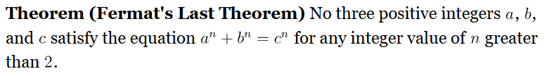

This is a Pandoc filter that adds theorem-like environments to Markdown documents.

For example, the following fancy block:

~~~
::: {.theorem-like name="Theorem" title="Fermat's Last Theorem" .unnumbered}
No three positive integers $a$, $b$, and $c$ satisfy the equation $a^n + b^n = c^n$ for any integer value of $n$ greater than $2$.
:::
~~~

will be converted to

[Try you own](https://functor.network/help/syntax?format=md#editor)